# オブジェクト指向設計

オブジェクト指向では初めに「属性(メンバ変数)」と「振る舞い(メソッド)」を良い感じにまとめてクラスを作って、それらを組み合わせてシステムを構築するんですよね！

ドキュメントを作るテキストエディタを作りたいです。ある理由があってJSONにしたりバイナリにしたいのでドキュメントクラスを次のように考えました

```cpp
class Document{
public:
virtual ~Document() = default;

virtual void exportToJSON( /*...*/) const = 0;
virtual void serialize(ByteStreame&, /**/) const = 0;
//...
};
```
これでDocumentクラスを継承したクラス(PDF, Word)が出てきてもJSONにexportでき、serializeはBYTEへの変換をできます。

---

# 実装を考えていくと結構依存入りません？

1. 派生クラスはexportToJSONを実装する
1. 多分、サードパーティのライブラリを使う
1. ライブラリを派生クラス間で揃える
→おめでとう派生クラス間でライブラリへの依存ができましたね！

serializeでも同じようにしますか。派生クラスはJSON化とシリアライズ化のライブラリの２つに依存しました！ヤッタネ！
シリアライズってどうします？リトルエンディアン？ビックエンディアン？システムのグローバルな決定事項に見えますけど、Documentクラスが責務持つんですね！

このシステムの保守や拡張は楽しい作業になりそうです！

---

# 変更ってどうなります？

- 使うJSONライブラリ変えました→全派生クラスを修正します！
- JSONライブラリが変化したので`exportToJSON`のシグネチャが変わりました→呼び出し元も全変更です！

`serialize`も同じこと発生しますね

なんかクラス分かれているけど、結局変更が入ると全部変更が必要になりそうです。少なくとも工数がかかると常に請求できそうです！

---

# なんでこうなった？

依存関係で見ると


Userに対して`JSON Lib`、`ByteStreame`の依存がついていますね。抽象化などで依存を切れそうですが、そもそも

---

# そもそも？

無関係のアスペクト(関心事)を一つのクラスにまとめてしまい、複数の変更理由でクラスに変更がおよぶSRP(単一責任の原則:Single responsibility principle)の見本のようなクラスでした。



JSON化とシリアライズはDocumentと関係ないため外に出しましょう。

---

# 結局？

```cpp
class Document{
public:
virtual ~Document() = default;
//...
};
```

Documentクラスは強い関係性を発生させない基本的処理だけを残して強い関係を生む操作は外に出すのがいいでしょう。