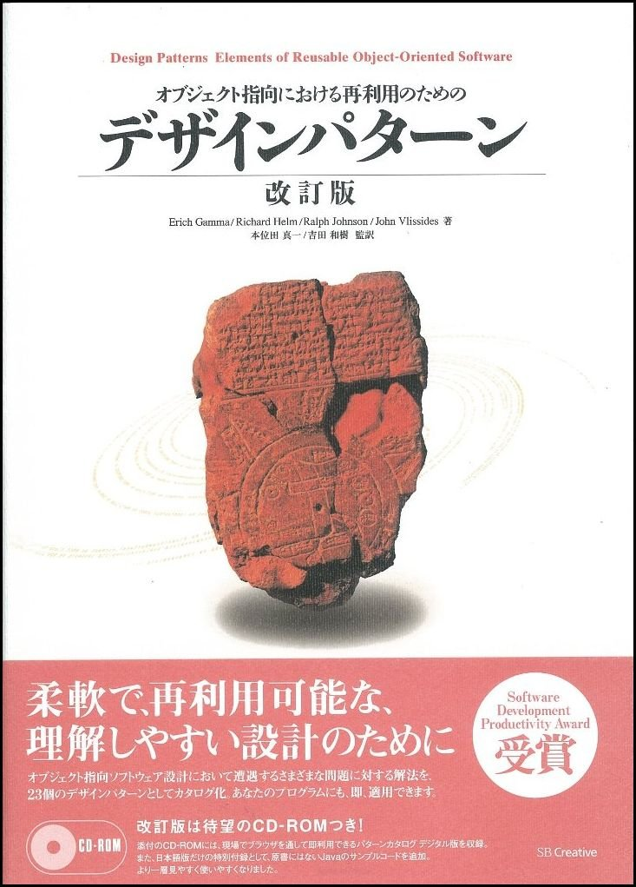
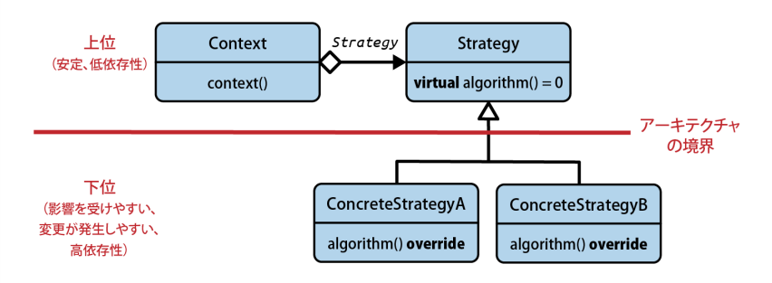

# デザインパターンの目的

## ガイドライン 11：デザインパターンの目的を把握する

デザインパターンとは何？  
Gang of Four(GoF)の書籍で有名になり、それ以降ソフトウェア業界ですごく一般的な言葉になった言葉



デザインパターンは様々な解釈がされるが以下の特徴をもつことは疑いがない
- 名前を持つ
- 明確な目的を持つ
- 抽象化する
- 検証済みである

## デザインパターンは名前を持つ/デザインパターンは目的を表す

設計を検討する際のやりとり、

A：既存の型を毎回変更せずに、処理セットを拡張できるようなシステムを構築するべきだと思うんだ。  
B：そうだろうか。僕は新規処理よりも、型を毎回新たに追加することを考えていたよ。だから型の追加が容易になるシステムの方が良いと思う。でも実装に依存し過ぎないようにするため、まぁ、依存しない方が良いに決まっているんだけど、どこかで派生してカスタマイズできるよう、既存の型と実装を分離する方式を考えたいな。  
A：あぁ、バリエーションポイントは必要になるだろうね。でも、今後は何度も処理セットを拡張しなきゃならないだろうから、持続できて、なおかつ既存の実装を簡単に再利用できるようなシステムを設計するべきなんだろうね。

### Visitor

GoF本での`振る舞いに関するパターン`に該当する。 アルゴリズムをオブジェクトの構造から分離するためのデザインパターン。  
つまり、既存の型を変更せずにアルゴリズムを追加できる。

### Strategy

GoF本での`振る舞いに関するパターン`に該当する。 アルゴリズムを実行時に選択することができるデザインパターンである。アルゴリズムを記述するサブルーチンへの参照をデータ構造の内部に保持する。  
つまり、アルゴリズムをオブジェクト化しており切り替えを容易にしている。

### Decorator

GoF本での`構造に関するパターン`に該当する。 既存のオブジェクトに新しい機能や振る舞いを動的に追加することを可能にする。  
つまり、既存のオブジェクトを再利用しながら機能を追加できる。

デザインパターンの名前と目的をしっていると、

A：僕ならここは Visitor を使うな。  
B：そうだろうか。僕は Strategy を考えていた。  
A：あぁ、どこかで必要になるだろうね。でも、今後何度も処理を拡張しなきゃならないだろうから、恐らく Decorator も検討する必要があると思う。

別の例を出すと、Strategy パターン、Command パターン、Bridge パターンでは実装を考えると構造的にほとんど差異がありません。しかし、それぞれの目的が大きく異なっているため、設計者の意図やシステムがどういう拡張に備えているかが明白になります。

### Strategy

アルゴリズムの切り替えが目的。だいたい、引数とかは一緒で処理だけが違うイメージ

### Command

操作を丸々カプセル化するイメージ。この操作はパラメータごとオブジェクト化されてキューイング、履歴の管理を可能にします。

### Bridge

共通のIFと実装を分離して、それらが独立して変更できるようにする大きな分離をするイメージ。グラフィック系の実装をするのであればDirectX OpenGLなど土台が異なるものに対してもできようできて、それぞれ発展させていく。

逆にいうと、Strategyを使っているのに処理自体をキューイングしてたり優先度ソートすると違和感があるし、アルゴリズムを切り替えるだけにBridgeと言われると違和感がある。

## デザインパターンは抽象化を導入する

デザインパターンはなんらかの抽象化を用いて依存関係を軽減する方法を提供する。



Strategy使用者をStrategy具象の実装詳細から切り離す。Strategy規定クラスを用いた抽象化。


こちらも生成処理を分離して依存関係を軽減している。大事なのは抽象化を用いて依存関係を軽減することなので、基底クラスを用いた実装だけでなく、テンプレートや関数オーバーロードを用いていも同様のことは可能です。
これらのことから、デザインパターンは特定の実装によらないものと言える。

特定の実装によるものの例として、`std::make_unique()`があります。
```
namespace std {
    template< typename T, typename... Args >
    unique_ptr<T> make_unique( Args&&... args );
} // namespace std
```
`std::make_unique`の動作は変更できません。デザインパターンと異なりカスタマイゼーションポイントを持っていないため、実装パターンといわれます。

## デザインパターンは検証が済んでいる

説明の順序こそ最後ですが重要なのが、デザインパターンは長い年月をかけて検証されて来た点です。

## ガイドライン 12：デザインパターンを誤解してはいけない


デザインパターンとはこういうものではないという理解も大事
- デザインパターンは最終目的であり、使用すれば高品質のソフトウェアが保証される
- デザインパターンは特定の実装、言語でのみ使用するイディオムである
- デザインパターンはオブジェクト指向プログラミングや動的多態性でなければ使えない
- デザインパターンは古く、時代遅れの代物である

### デザインパターンは最終目的ではない

過剰なまでに利用するとコードの複雑度ばかりが増加してしまい読解性が落ちてしまう。デザインパターンは抽象化を導入するための機構を持っているため、機構だらけのコードは抽象と具体の境目が分かりにくくなってしまう。

デザインパターンは最終目的ではありません。常にコードの複雑度を減らし、良いソフトウェア構造の目指すことが大事。

まとめると、「銀の弾丸」があると確信してしまうことや「金のハンマー」を手にしてしまうことは避けようね、ということ

### デザインパターンは実装詳細ではない

デザインパターンはオブジェクト指向や継承(動的多態性)に限定されない。

```cpp
// データをいろいろな順番にソートして参照できる
template< class SortStrategy >
class Index {
public:
    void Index(const Data& data);

    Itrator begin();
    ...
}
```

テンプレートパラメータでSortアルゴリズムを変更できる。

```cpp
std::accumulate(v.begin(), v.end(), 1, std::plus<>{})
std::accumulate(v.begin(), v.end(), 1, std::multiplies<>{})
```

オブジェクト指向以外でもstrategyの変更は可能である。
